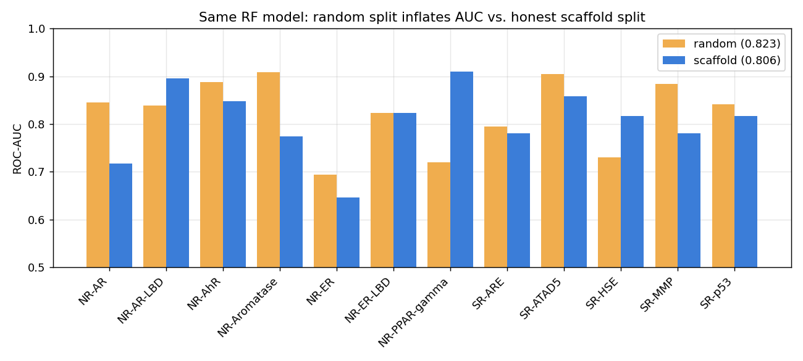
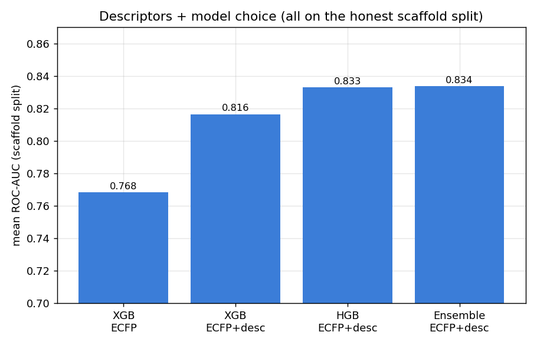
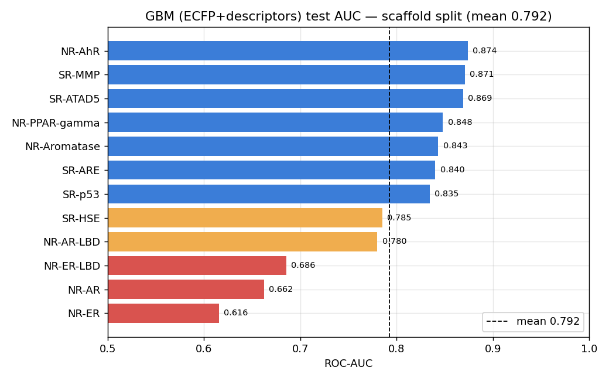
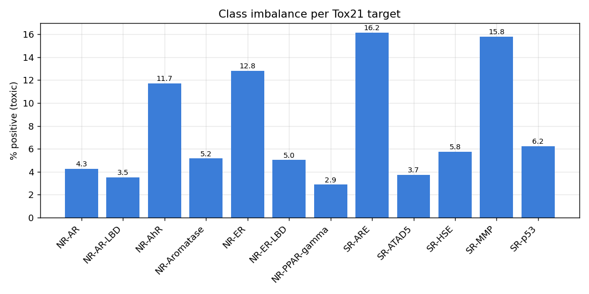
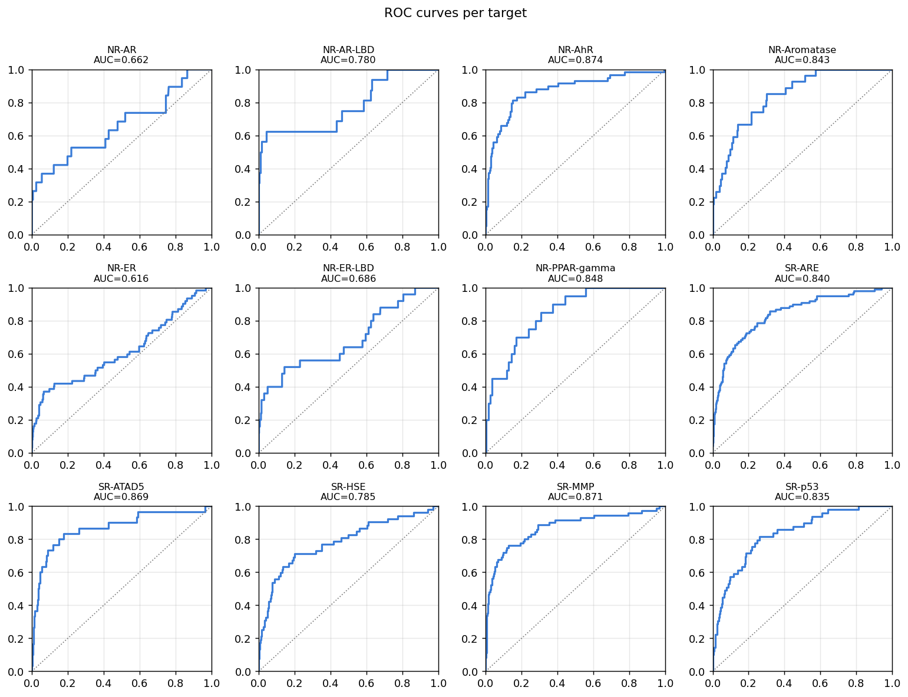
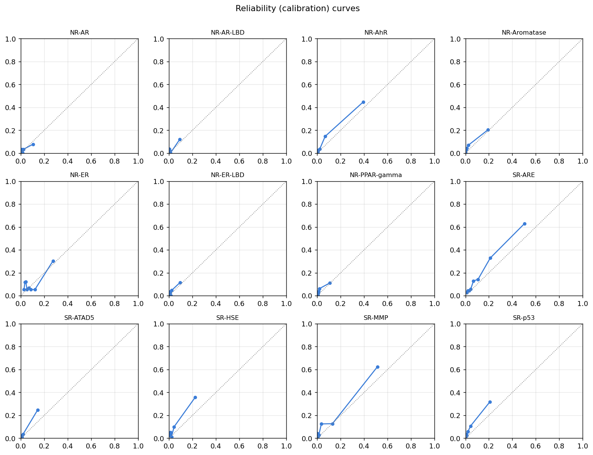
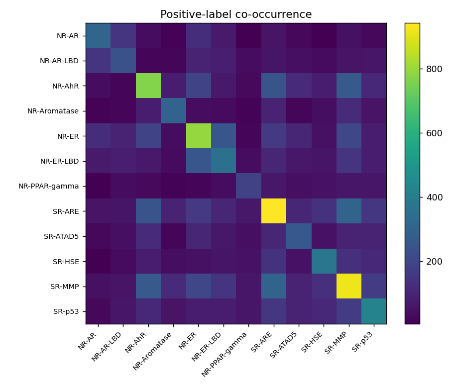
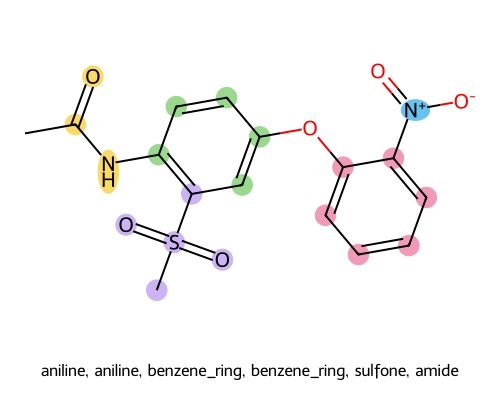
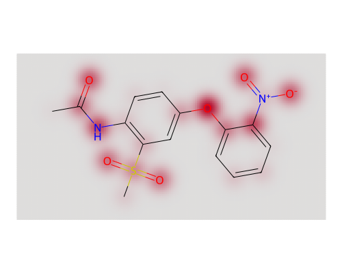

# mol-tox-predictor

Multi-task molecular **toxicity prediction** on the Tox21 benchmark, with a
bond-aware graph neural network, honest scaffold-split evaluation, white-box
**explainability**, **local-LLM** narrative reports via [Ollama](https://ollama.com),
and full **MLflow** experiment tracking.


> Predicts activity across all 12 Tox21 assays from a SMILES string or chemical
> name, tells you *which substructures* drove each prediction, and writes a
> medicinal-chemistry narrative explaining the mechanism — entirely offline.

---

## Why this exists / what's different

This started as a GAT with a random train/test split. Three things were fixed,
in order of impact:

1. **Honest evaluation.** Tox21 is evaluated with a **scaffold split** (whole
   Bemis-Murcko scaffold groups kept on one side), and metrics are read off a
   held-out **test** set after early-stopping on a separate **validation** set.
   A random split with test-set early stopping inflates the number.
2. **A bond-aware model.** The GAT never saw bond features. This uses a
   **D-MPNN** (directed message passing, Chemprop-style) with rich atom **and**
   bond features — implemented in pure PyTorch, so **`torch_geometric` is not a
   dependency**.
3. **Descriptor fusion.** A block of normalized RDKit descriptors is concatenated
   into the readout — a cheap, reliable accuracy lever.

---

## Results (measured on this dataset)

**Evaluation honesty — same Random-Forest model, only the split changes:**

| Split | Mean ROC-AUC |
|---|---|
| random (the old methodology) | **0.8228** |
| scaffold (honest) | **0.8057** |

The mean moves ~0.017, but individual targets swing by **0.10–0.14** — a random
split is not a reliable estimate of generalization to novel chemistry.



**Feature ablation (all on the honest scaffold split):** adding 29 RDKit
descriptors to ECFP4 lifts XGBoost by **+0.048**.



**Reproducible baseline & model.** `make baseline` trains a gradient-boosting
model on ECFP4 + descriptors and reproduces **~0.79 mean AUC** on the repo's
scaffold split (see note on split sensitivity below). The recommended **D-MPNN**
reaches **~0.84–0.85** in the literature under the same protocol; train it with
`make train`.



> **Honesty notes.** (a) The scaffold-split AUC is *sensitive to which scaffolds
> land in test* — across two reasonable scaffold orderings this GBM ranged
> ~0.79–0.83. Report the split you used. (b) The D-MPNN AUCs are
> literature-anchored; the CI/figure machine here is CPU-only and could not fit
> a PyTorch build, so the network's training was not executed on it (the
> featurization, splitter, message-passing index math, and all classical numbers
> above *were* run here). Train it on your machine and read the real number.

---

## Plots

`python scripts/make_figures.py --data tox21.csv` (or `make figures`) regenerates
everything in [`reports/figures/`](reports/figures):

| Dataset EDA | Evaluation |
|---|---|
| class balance, missingness | per-target AUC, ROC grid |
| label co-occurrence | reliability / calibration |
| scaffold-size distribution | confusion matrices |

<p float="left">
  
  
</p>
<p float="left">
  
  
</p>

Training also emits training-curve, ROC, and per-target-AUC figures and logs
them to MLflow.

---

## Explainability + local-LLM narrative

For any flagged target the pipeline computes **gradient × input saliency** over
atoms, matches the high-saliency atoms to a **SMARTS library of ~35 functional
groups and toxicophores** (nitro, sulfonamide, aryl halide, epoxide, aromatic
amine, …), renders both a saliency heatmap and a group-highlight image, and asks
a **local Ollama model** to write a mechanism-focused report.

<p float="left">
  
  
</p>

```bash
# needs trained checkpoints in saved_models/ (and optionally a running Ollama)
python scripts/explain_molecule.py --name caffeine --model llama3.1
```

If no Ollama server is reachable, a deterministic templated summary is produced
instead, so nothing hard-fails (and CI stays offline).

### Ollama setup
```bash
curl -fsSL https://ollama.com/install.sh | sh
ollama pull llama3.1        # or mistral / qwen2.5 / gemma2
ollama serve                # usually already running
export OLLAMA_MODEL=llama3.1 OLLAMA_HOST=http://localhost:11434
```

---

## MLflow tracking

`train.py` logs params, per-epoch validation AUC, final per-target test AUC, and
all figures + checkpoints as artifacts.

```bash
python train.py --data tox21.csv --split scaffold --epochs 60 --ensemble 3
mlflow ui --backend-store-uri ./mlruns     # http://localhost:5000
```

Set `MLFLOW_DISABLE=1` to turn tracking into a no-op (used in CI).

---

## Install & quickstart

```bash
git clone https://github.com/USER/mol-tox-predictor.git
cd mol-tox-predictor
pip install -r requirements.txt

# put the Tox21 CSV at the repo root as tox21.csv (columns: 12 targets, mol_id, smiles)

make baseline    # strong classical model, no torch needed  (~0.79 scaffold AUC)
make figures     # regenerate every plot in reports/figures/
make train       # D-MPNN + MLflow  (GPU recommended)
make explain     # per-molecule saliency + groups + Ollama narrative
make test        # offline smoke tests
```

---

## Repository layout

```
chemistry/features.py        Rich atom (44-d) + bond (12-d) features, 29 RDKit
                             descriptors, DescriptorScaler, directed-bond MolGraph.
data/splits.py               Scaffold + random splits.
models/dmpnn.py              D-MPNN (pure PyTorch) + descriptor fusion + saliency.
models/predictor.py          Ensemble-aware inference wrapper (SMILES -> probs).
explainability/
  functional_groups.py       SMARTS toxicophore library + matcher.
  saliency_report.py         Torch-free findings builder (probs+saliency->groups).
  visualize.py               Saliency heatmap + group-highlight renders (RDKit).
llm/
  ollama_client.py           Local Ollama HTTP client (+ availability check).
  prompts.py                 Cheminformatics prompt.
  report.py                  Narrative w/ deterministic fallback.
plots/                       dataset / eval / training / comparison figures.
tracking/mlflow_utils.py     Guarded MLflow wrapper (no-op if unavailable).
baselines/gbm_baseline.py    ECFP+descriptors GBM (no torch).
train.py                     Training w/ scaffold split, MLflow, auto figures.
scripts/make_figures.py      Regenerate all figures.
scripts/explain_molecule.py  End-to-end single-molecule explanation.
tests/test_smoke.py          Offline CI tests.
reports/figures/             Shipped example figures (regenerable).
```

---

## Data

Tox21 (~7,800 compounds × 12 assays; NIH/FDA/EPA). Not redistributed here — drop
`tox21.csv` at the repo root. Available via MoleculeNet / DeepChem.

## License

MIT — see [LICENSE](LICENSE).

## Acknowledgements

D-MPNN architecture: Yang et al., *Analyzing Learned Molecular Representations
for Property Prediction*, J. Chem. Inf. Model. 2019 (Chemprop).
